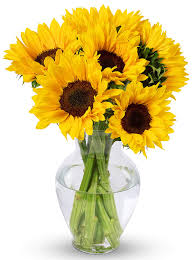

# Preparing Flowers in a Vase
----

## Introduction
----
When you receive a thoughtful or congratulatory bouquet of flowers and you want to keep them looking pretty for as long as possible, but your mom isn't there to help you, what do you do? Below are some tips that can help you accomplish a vase full of flowers your mom would be impressed with.

## Steps
--------------------------------------
### 1. Get a vase that will best fit the flowers.
 - The flowers should stick out several inches from the vase.
 - Stems should not be held tight by the opening of the vase.
### 2. Clean the vase with soap and water.
 - Rinse well to prevent soapy water contaminating flower water.
### 3. Cut rubber bands holding the cellophane to the flowers.
### 4. Unwrap the cellophane from around the flowers.
 - Keep the flower food packet if it is in the wrapping.
### 5. Open the food packet.
### 6. Pour into the empty vase.
### 7. Fill the vase half way with warm water.
### 8. Swirl the vase to help dissolve the contents.
### 9. Diagonally cut 2 inches off each flower stem using scissors. 
 - If the flowers will be too short for the vase if 2 inches are cut off, cut a smaller portion off.
### 10. Put flowers into the vase.
### 11. Place the vase on a counter or table.
 **Warning:** Keep out of reach of pets and children.
 
